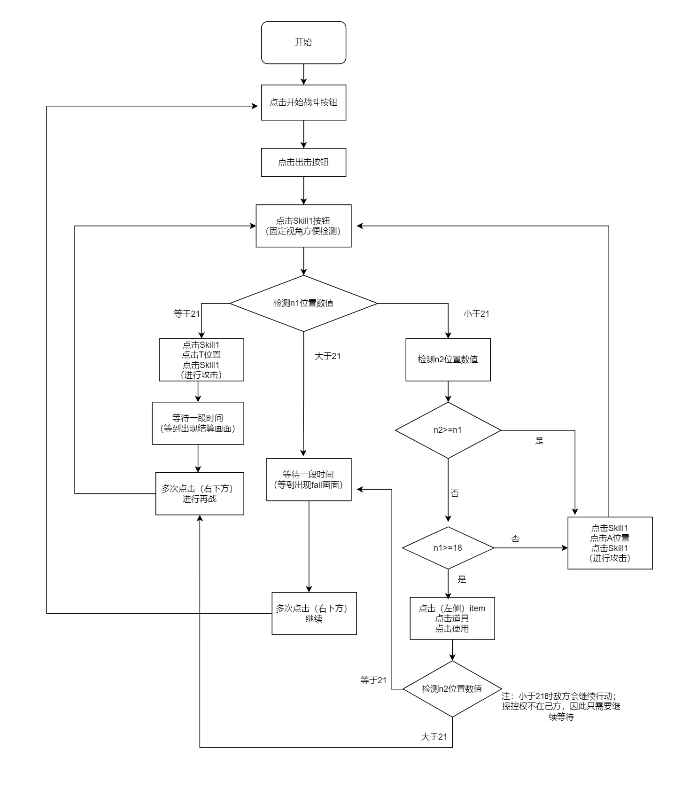

# note
A25手游圣诞活动 21点游戏  
就是个刷活动点数的自动脚本  
并没有太多复杂的操作，不过之前没写过所以记录一下


## 准备

### 游戏规则  
直接攻击牌为`抽牌`  
扔道具为`换敌方抽牌`
超过21点直接失败  

当己方为21点时，才能有效攻击敌方；否则伤害为0攻击无效  
当敌方点数 大于 己方点数，敌方能打败己方  
简单说就是 己方只有刚好21点才能获胜，而敌方只需要点数大于己方就可以获胜

应该根据己方和敌方当前的点数进行判断和操作  
采取操作如下  
查看n1、n2数值  
n1小于18且n1大于等于n2，攻击抽牌；否则扔道具让地方行动  
n2大于n1时，无论当前n1是什么值都攻击抽牌  
n1等于21，直接攻击敌方
n2等于21，直接重开

大概流程如下  
注：己方数字为n1，敌方数字为n2


但实际操作中，图片识别率太低所以实际脚本并不符合以上流程  
后来只识别了n1的值    


### 图片截取
截取游戏画面和需要识别的按钮  
有些按钮如果不需要/不想使用识别，可以直接记录按钮所在的位置坐标，需要点击时根据坐标直接移动到目标位置    
如果图片识别率比较高，使用识别计算位置更方便，不用记录那么多坐标值，也不容易搞混  
但当前识别率太低，所以后来很多按钮都选择直接使用位置坐标   


### 安装
#### tesseract-ocr安装  
https://github.com/tesseract-ocr/tesseract

安装文档  
https://tesseract-ocr.github.io/tessdoc/Installation.html

这里使用的是windows安装包  
安装完成后需要把执行文件所在的文件夹添加到系统的`PATH`环境变量中，以便于使用  
https://github.com/UB-Mannheim/tesseract/wiki


#### 安装图片识别所需库
```shell
pip install pillow pytesseract opencv-python
```

#### 安装处理图片所需库（可选）
```shell
pip install numpy
```

#### 安装操作所需库
```shell
# 获取游戏窗口信息所需库
# 此库主要用于获取窗口位置
pip install win32gui

# 自动操作所需库
pip install pyautogui
```


## 实战

### 基本操作工具函数

#### 图片处理相关
获取指定图片中间位置坐标  
系数原本定为0.95，后改为0.93；但匹配时有时仍然会低于这个值
```python
import cv2

def image_to_position(screen, template):
  screen = cv2.imread(f"{current_dir}/screenshot.png")
  image_x, image_y = template.shape[:2]
  result = cv2.matchTemplate(screen, template, cv2.TM_CCOEFF_NORMED)
  min_val, max_val, min_loc, max_loc = cv2.minMaxLoc(result)
  print("prob:", max_val)
  if max_val > 0.93:
    # 中间位置
    pos = (max_loc[0] + image_y / 2, max_loc[1] + image_x / 2)
    return pos
  else:
    return (0, 0)
```

指定区域截图  
游戏窗口分辨率为1280 x 720
```python
import pyautogui

def get_screenshot(x, y):
  # pyautogui.screenshot(f"{path}/screenshot.png",region=[x + lb, y + tb, 1280, 720])
  # screenshot = pyautogui.screenshot(region=[x + lb, y + tb, 1280, 720])
  screenshot = pyautogui.screenshot(region=[x, y, 1280, 720])
  screenshot.save(f"{current_dir}/screenshot.png")
  return screenshot
```

在已存在图片中截取指定大小的图像
screenshot 原存在图片  
pos_x, pos_y 截取起始x,y位置  
width, height 截取图片长宽 
out_file 截取后输出文件
```python
from PIL import Image

def shot_number_img(screenshot, pos_x, pos_y, width, height, out_file):
  img = Image.open(screenshot)
  region = (pos_x, pos_y, pos_x + width, pos_y + height)
  cropImg = img.crop(region)
  cropImg.save(f"{current_dir}/{out_file}")
  print("exported:", out_file)
```

图片ocr，获取数字字符串
```python
from PIL import Image
import pytesseract

def image_ocr(file_name):
  image = Image.open(file_name)
  config = "--psm 7 --oem 3 -c tessedit_char_whitelist=0123456789"
  content = pytesseract.image_to_string(image, config=config)   # 识别图片内容
  print(content)
```

处理图片，提高识别率（可选）
```python
import numpy as np

def preprocess_image(image_path):
  # 1. 读取图像（保留原始色彩通道）
  img = cv2.imread(image_path, cv2.IMREAD_COLOR)

  # 2. 灰度化（非必须，根据场景选择）
  gray = cv2.cvtColor(img, cv2.COLOR_BGR2GRAY)

  # 3. 噪声消除（自适应选择算法）
  denoised = cv2.fastNlMeansDenoising(
      gray, h=30) if np.mean(gray) < 200 else gray

  # 4. 二值化（动态阈值处理）
  thresh = cv2.adaptiveThreshold(
      denoised, 255,
      cv2.ADAPTIVE_THRESH_GAUSSIAN_C,
      cv2.THRESH_BINARY_INV, 11, 2
  )
  # 5. 形态学处理（强化文本）
  kernel = cv2.getStructuringElement(cv2.MORPH_RECT, (2, 2))
  morph = cv2.morphologyEx(thresh, cv2.MORPH_CLOSE, kernel)
  # 6. 边缘保留平滑
  smoothed = cv2.edgePreservingFilter(morph, flags=1, sigma_s=60, sigma_r=0.4)
  # 7. 对比度增强（CLAHE）
  clahe = cv2.createCLAHE(clipLimit=2.0, tileGridSize=(8, 8))
  enhanced = clahe.apply(smoothed)
  return enhanced
```


#### 窗口操作相关
移动鼠标到指定屏幕坐标
```python
def mouse_move(x, y, duration=0.05):
  print("move: ", x, y)
  pyautogui.moveTo(x, y, duration=duration)
```

鼠标操作
```python
# 左键单击/双击，右键单击
def mouse_click(operation='click'):
  if (operation == 'click'):
    pyautogui.click()
  elif (operation == 'double'):
    pyautogui.doubleClick()
  elif (operation == 'right'):
    pyautogui.rightClick()

```


#### 其他工具
获取目标程序窗口
```python
def get_tar_window():
   # 目标程序标题
  title = "レスレリアーナのアトリエ"
  # 获取目标窗口句柄
  hwnd = win32gui.FindWindow(None, title)
  # win32gui.GetWindowText(hwnd)
  # test_obj.update({hwnd: win32gui.GetWindowText(hwnd)})
  return hwnd
```

字符串处理，获取数字
```python
def filter_text(ori_text):
  return re.sub(r'[^\d]', '', ori_text) 
```

计算时间差
```python
def duration_time(start, end):
  return end - start
```

计算时间差
```python
def duration_time(start, end):
  return end - start
```

根据当前n1,n2数值采取行动（实际不采用）
```python
def handle_num(num1, num2):
  if(num1 === 21):
    # 攻击T位置
  else:
    if(num2 > num1):
      # 攻击A位置，抽牌
    elif:
      if(num1 >= 18):
        # 使用道具，让敌方行动
      else:
         # 攻击A位置，抽牌
        
```


### 流程
#### 战斗准备界面
以进入到活动界面开始，需要依次点击  
`编成` `出击` 按钮  
直到进入战斗界面  
这两个按钮都在右下角，因此这两次操作不需要移动鼠标位置
根据检测skill存在与否，判断是否已经进入战斗界面  

#### 战斗界面
检测n1和n2值，根据双方的值判断下一步行动

#### fail界面
点击右下方按钮，可以进入准备界面

#### 胜利界面
点击右下方按钮2次，直到出现`再战`按钮
点击`再战`按钮，可直接进入战斗界面
点击`继续`按钮，则进入准备界面


### 已解决问题
#### 战斗界面
- skill按钮识别问题
可能因为按钮背景为半透明，当视角转到不同角度时，有时会因为背景不同导致识别率降低  
无法正确判断，即无法得知是否已经进入战斗界面  
因此需要循环持续进行识别判断  
但若视角刚好固定在一个无法识别的地方，则会陷入循环  
所以后来进行了循环次数记录以跳出循环

- skill菜单状态问题
菜单展开时skill图标与平常状态相差不大，无法根据图标进行判断
（即example文件夹中`skill1_active.jpg`和`skill1_normal.jpg`相似度较高，无法判断状态）  
因此在点击skill按钮前，先点击其他地方，保证当前菜单为关闭状态

- item相关按钮无法识别
直接使用按钮坐标获取目标位置

#### 胜利界面
- 继续按钮无法识别
直接使用固定坐标

- 继续按钮无法点击
使用右键点击，以进行下一步
实际这个没搞清到底是什么问题，手动能点到；但使用自动点击时，左键无论是双击单击都不行，所以最后只能用右键  
如果不是无法点击，这按钮位置和失败界面差不多，使用持续点击右下角的逻辑就可以

- 无法判断是否已经进入胜利界面
因为继续按钮无法正确识别，所以无法判断
使用计时，若在规定时间内无法识别到skill按钮，则进行2次右键点击，再左键点击 再战 按钮位置  

#### fail界面
- 在该界面错误识别出数字
错误识别出数字，导致一直循环执行攻击操作；胜利界面有时也会出现这个问题  
记录上一次的数字值`old_num`，当数字值相同时，说明大概率是识别错误，当前已经是结算界面，可直接执行持续点击右下角的逻辑  
但当上一次结束时的数字与当前初始数字相同时，会出现问题（一局结束时画面变化快，不方便截取和识别数字） 
当重新开局时，把`old_num`的值设为-1

#### 其他
- 出现网络问题时需要点击进行重连
检测是否出现了网络错误提示；该提示识别率较高，可以直接进行判断  


### 未解决问题
图片识别率太低，识别经常不准确，导致很多地方都得使用坐标  
数字识别不准确，导致需要很多额外的判断  
n2数字位置识别率极低，加上要截取数字需要调整视角，操作繁琐还经常识别错误，所以后来去掉了n2数字的识别  
n1数字识别率一般，经常把2位数字识别为3位，不过这种可以直接-100处理；主要问题还是非战斗界面的错误识别
**总之以上这些归根结底是ocr识别率低，导致出现了很多预料之外的问题**

为了方便所以对游戏进行了加速，可能是因为加速原因，一段时间后出现网络问题重连时，会提示登录信息过期之类的，需要重新从最开始的登录画面进入游戏  
从 登录画面 到 活动界面 再到 指定的21点活动界面 这个流程需要比较多的点击和检测，所以没有做这部分的流程  
所以如果需要重新登录，则脚本无法自动重刷  


## 总结
代码部分其实不算难写，理清楚流程之后还算容易写  
主要是准备工作时的截取图片比较花时间  

遇到最大的问题还是在于图片识别上，可能是游戏UI大部分都使用了半透明设计的原因，导致识别率不高  
因为识别率不高，所以需要添加很多额外的判断和处理；也使得最终无法根据原本设想的流程处理  
也是因为识别率的问题，导致有些示例图片没有用上，记录各种按钮的位置坐标上也花了一些时间


## 其他补充

### 文件说明
**screenshot**  
测试时用的截屏图片，实际执行脚本时不需要
  
**example**  
用于识别的示例图片，主要用于判断  

**2_ocr_test.py**  
ocr测试用  

**4_update.py**  
初始需要检测n1，n2数字的版本
  
**5_only_num1.py**
只检测n1的版本，但很多地方不完善
  
**6_only_num1_update.py**  
实际使用的版本，大部分情况下能用，但还存在问题和优化空间

### 优化方向
提高图片识别率  
拆分不同工具模块
图片不要保存到硬盘，直接进行处理  

### END
虽然能用而且胜率感觉好像还行，但还是有很多需要改进的地方  
不过因为现在用不上（活动已结束），所以等到活动再开的时候可能会改进吧，虽然应该大概不太可能再开（  
加上使用脚本时需要前台执行，需要占据电脑，所以也只能在空闲时使用；下次再用考虑使用虚拟机后台执行


